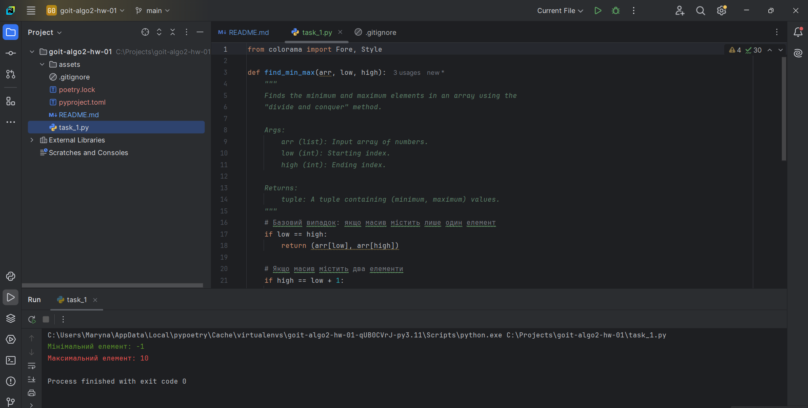

# Algorithm Analysis. Divide and Conquer Strategy

## Welcome to the first homework assignment! 🙂 How are you feeling?

Today, you will practice the correct application of algorithms for specific tasks,
which is crucial for developing efficient programs. This homework will help you 
reinforce your understanding of the algorithmic approach "Divide and Conquer."

The homework consists of two independent tasks: one mandatory and one optional.

---

## Task 1 (Mandatory). Finding the Maximum and Minimum Elements

Implement a function that finds the maximum and minimum elements in an array 
using the "Divide and Conquer" method.

### Acceptance Criteria

📌 The acceptance criteria for this homework are mandatory for it to be reviewed
by a mentor. If any of the criteria are not met, the mentor will return the 
homework for revision without evaluation. If you "just need to clarify" 
😉 or you "got stuck" at some stage, feel free to reach out to the mentor on Slack.

- The function accepts an array of numbers of any length.
- A recursive approach is used.
- The function returns a tuple of values (minimum, maximum).
- The algorithm's complexity is O(n).

---

## Task 2* (Optional). Finding the k-th Smallest Element

Implement an algorithm to find the k-th smallest element in an unsorted array 
using the Quick Select principle.

### Execution Conditions

- The function should accept an array of numbers and an integer k.
- The approach must use a pivot element selection.
- The array should not be fully sorted.
- The expected average-case complexity should be O(n).

📌 **Note:** Quick Select is an example of the "Divide and Conquer" method, 
but in our case, the **Combine** step does not require additional work. 
Once the desired element is found, it is simply returned.

# RESULTS

